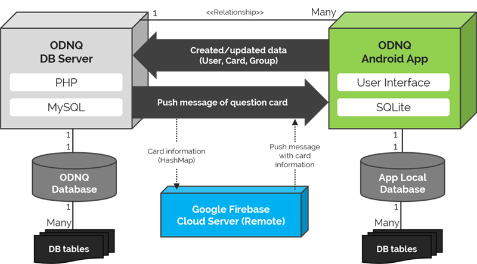

# 1-Day-N-Questions

## Introduction

Name of platform: ***1-Day-N-Questions*** (N can be an arbitrary number)

Our platform utilizes crowdsourcing technique to address issues of the fairness of education. Our main goal is to offer equal opportunity to learners based on crowdsourced knowledge. Our system basically supports learners just like a *study-group system*. More specifically, Every user can be both a requester and a worker, and each user receive help from (or offer help to) other users over our platform. The users can benefit from not only *sharing their customized problems*, but also *managing their own learning history*. Lastly, for the sake of implementation-level simplicity, we only focus on English-related problems, such as English words, phrases, and sentences.

## Requirements

### Task 1. Making a New Problem

+ **Requirement 1-A: A system must provide a submission form for a user to fill out or customize**
	
+ **Requirement 1-B: Each problem (question) has to contain a time limit defined by a question maker**
	
+ **Requirement 1-C: A system must check redundancy of written problems and filter out them in real-time**

### Task 2. Solving and Evaluating Problems

+ **Requirement 2-A: A system must provide an automatic process for users to receive problems**

+ **Requirement 2-B: A system must provide a simple interface and process for users to solve problems**
	
+ **Requirement 2-C: A system should give the users a way to evaluate the given problems**

## System Architecture

## INSTRUCTION

### A. INTERFACES OF One-Day-N-Questions (focusing on Android app)

***Main Dashboards***

- My Achievements
- Study Note

***Card management***

- Card creation
- Starring card
- Card evaluation

***Group management***

- Checking my group information
- Leave my existing group
- Make my new group
- Find and join a new group

***Study Reviewing***

- Reviewing starred card
- Solving more word-cards
- Solving system-recommended word-cards

### B. Make a new word-card & Add it to my word note & Share the card with crowds

- **Instruction**
	- First task is to make a word note with an application. Broadly, the way to make a word note in the application resembles to the way to make a quiz to other people. 
	- At first, you should choose a type of an English vocabulary (in the prototype, it is fixed to "WORD").
	- Second, type a question on the application.
	- Third, type possible answers on the blank (in the prototype, sample answers are given by a prototype).
	- Next, type possible tags which can characterize the word or the phrase in the question.
	- Then, type hints if you want.
	- You need to also set the time limit of the question.
	- At last, type "OK" button to finish the task.
	- Although most of tasks are done automatically, please imagine that you are doing the task manually.
	- Please do given instructions while you read any English textbook.
	- You can give any kind of feedbacks from very small details such as a name of a button in the application, to a very broad concept.
	- Do this task in 15 minutes. 

### C. Solve a question-card & Check your achievements and study history

- **Instruction**
	- Second task is to solve a given question of the application, and evaluate it. A question is given to the users by a push alarm.
	- You should do this task while doing other works. When you get an alarm, you check the alarm and clicking the alarm will let you get into the application automatically.
	- When you get into the quiz, you can type a possible answer of the quiz. You have to solve the question in limited time suggested, then click check button to see an answer.
	- After see the answer, you should check whether you are right or wrong, and click right or wrong button according to your answer status.
	- After solving a question and checking rightness, you can
	 + Push "QUIT" button to end the application, or
	 + Push "Goto 1DNQ App" button to check study status of yourself. In this menu you can check:
		 -	Your study records, including a list of English vocabulary you learned through the application and your English skill status on each type of vocabulary, by using MyStudy menu
		 -	Control study groups you are now in, by using Study group menu, or
		 -	You can quit the application using the sign out button
	- In prototype, you can get a push alarm after quit the application and be in background screen. Thus, after using the application, please push QUIT or sign out button to end the application.

## Database

- **Table User**
	- user\_id, user\_nick,  user\_name, user\_age, user\_gender, user\_deviceid, user\_exp,  user\_quality, user\_token
- **Table Card**
	- card\_id, card\_datetime, card\_type, card\_maker, card\_group, card\_question, card\_answer, card\_hint, card\_difficulty, card\_quality, card\_solvednum, card\_evalnum
- **Table Groups**
	- group\_id, group\_goal, group\_name, group\_leader, group\_usernum, group\_date, group\_desc
- **Table Usergroup**
	- group\_id, user\_id, usergroup\_cardnum, usergroup\_exp, usergroup\_cont, usergroup\_regisdate
- **Table Userlog**
	- user\_id, log\_timestamp, log\_duration, log\_curactivity, log\_curevent

## Libraries

- Android GraphView: http://www.android-graphview.org/

## Contributors

- Sunggeun Ahn (topmaze@kaist.ac.kr), Human Computer Interaction Lab, KAIST
- Young-Min Baek (ymbaek@se.kaist.ac.kr), Software Engineering Lab, KAIST
- Sungjae Hong (yain@kaist.ac.kr), KAIST

 

